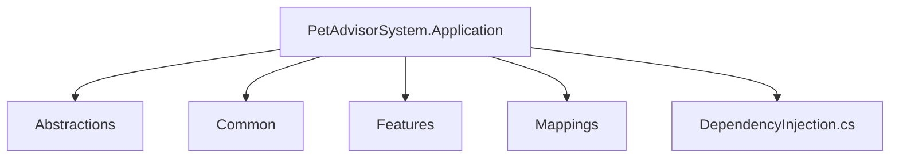

# 📂 Documentation: Application Layer (PetAdvisorSystem.Application)

Tài liệu kỹ thuật (Technical Documentation) mô tả chi tiết chức năng, tổ chức thư mục và hệ sinh thái thư viện (NuGet packages) được cấu hình trong tầng **Application** của dự án **Pet-Advisor-AI**. Thiết kế của Layer này là kết hợp chuẩn nguyên tắc **Clean Architecture** (nằm trên Domain Layer) và mẫu thiết kế **CQRS** (Command Query Responsibility Segregation).

---

## 📦 1. Tech Stack & NuGet Packages

Application là **trái tim (Business Logic)** của hệ thống, điều phối và xử lý toàn bộ logic nghiệp vụ mà không bị trói buộc với Data Access Layer hay Framework WebAPI/Controllers.

*   **Target Framework:** `.NET 8.0`
*   **Các NuGet Packages bắt buộc (.csproj):**
    *   `MediatR`: Thư viện lõi thực hiện điều phối Request/Response theo kiến trúc CQRS và triển khai Pipeline Behaviors. (Cắt giảm Dependencies trực tiếp giữa WebApi và Services).
    *   `FluentValidation`: Validate dữ liệu đầu vào. Trả về Validation Error chi tiết (Không ném exception bừa bãi).
    *   `FluentValidation.DependencyInjectionExtensions`: Đăng ký Validator tự động vào ASP.NET Core DI Container.
    *   `AutoMapper`: Framework ánh xạ đối tượng Entity -> DTO hoặc DTO -> Entity tự động, giảm thiểu mã lặp Boilerplate.
    *   *(Các package này sẽ được chêm vào dự án thông qua extension `DependencyInjection.cs`).*

---

## 🏗️ 2. Sơ đồ CQRS / Pipeline Request

---

## 🔍 3. Chức năng chi tiết từng Thư mục

### 📁 3.1. `Abstractions` (Định nghĩa Giao Ước / Hợp Đồng)
**Chức năng:** Tầng Application được phép gọi xuống Database (SQL/EF Core) thay phiên cho bên thứ ba, nhưng chỉ thông qua "Bản Hợp Đồng". Không được tham chiếu trực tiếp Repository của Infrastructure mà tự tay viết lên Interface bảo vệ độc lập cho mình.

*   **`Repositories/` (Kho dữ liệu):**
    *   `IPetRepository`: Interface định nghĩa các Function `Add`, `Update`, `GetByIdAsync`.
    *   `IUnitOfWork`: Interface cho Transaction (Unit of Work Pattern), ép mọi thay đổi diễn ra trong 1 phiên duy nhất (ví dụ: `SaveChangesAsync`).
*   **`Interfaces/` (Các Dịch Vụ Mở Rộng):**
    *   `ICurrentUserService`: Định danh của User (Guid) gửi request (Lấy JWT ngầm).
    *   `IEmailService`, `IStorageService`: Giao ước chức năng xử lý Email SMS hoặc Upload AWS.

### 📁 3.2. `Common` (Base Components & Pipeline)
**Chức năng:** Các cấu trúc tiện ích bắt chéo (Cross-cutting Concerns) dùng chung trên mọi Request trong Application.

*   **`Models/`:**
    *   Các Wrapper Objects: `Result<T>` (Thay vì API trả về Data thô, nó trả về `{ Success: true, Data: ..., Message: ... }`).
    *   `PaginationResponse<T>`: Trả về Object có thuộc tính `TotalRecords`, `TotalPages`...
*   **`Behaviors/` (MediatR Pipeline Behaviors):**
    *   `ValidationBehavior`: Middleware can thiệp vào Request trước khi gọi đến `Handler`. Nó sẽ gọi `FluentValidation` và throw `ValidationException` nếu dữ liệu Request sai cấu trúc.
    *   `LoggingBehavior`: Theo dõi và Log toàn bộ thời gian xử lý CQRS Command.
    *   `TransactionBehavior`: Tự động UnitOfWork mở / Đóng phiên Commit lưu Database mà không cần lập trình viên gõ code dư thừa ở mỗi hàm.

### 📁 3.3. `Features` (Nghiệp vụ Xử lý CQRS)
**Chức năng:** Thay vì cấu trúc `Services` cũ mèm, hệ thống chia folder theo các Entity cốt lõi (Tính năng nghiệp vụ).

*   **Cấu trúc Feature (Ví dụ: `Pets/`)**
    1.  **`Commands/` (Xử lý Ghi Nhập):** Các thao tác (Create, Update, Delete) thay đổi State.
        *   Quy tắc đặt tên file: `[Hành Động][Tên Feature]Command.cs` 
        *   Bao gồm DTO gửi lên: `CreatePetCommand`, bộ kiểm soát lỗi: `CreatePetCommandValidator`, và lõi xử lý: `CreatePetCommandHandler`.
    2.  **`Queries/` (Xử lý Đọc Lấy):** GetList, GetDetail, FilteredList.
        *   Trong Query `Handler`, cho phép đọc trực tiếp từ `Dapper` (Thủ công SQL, raw query) để tăng tốc độ phản hồi cực điểm vì không cần dùng Object Change Tracking của Entity Framework.
    3.  **`DTOs/` (Data Transfer Objects):** Đối tượng mỏng chỉ chứa các dữ liệu (Properties) được public trên Response Web API thay vì trả toàn diện Entities nhạy cảm.
        *   Ví dụ: `PetResponseDto`, `PetPaginationRequest`.

### 📁 3.4. `Mappings` (AutoMapper Profile)
**Chức năng:** Trung tâm điều khiển và đăng ký ánh xạ (Mapping) chuyển đổi giữa Entity (`Pet`) -> DTO (`PetResponseDto`) và ngược lại.

*   `AutoMapperProfile.cs`: 
    *   `CreateMap<Pet, PetResponseDto>()`
    *   Trong cấu hình nâng cao, cho phép ForMember (chỉ định Property `PetType` tự động chuyển đổi từ số Enum thành Chuỗi Tên `Dog`).

### 📁 3.5. `DependencyInjection.cs` (Bootstrapper)
**Chức năng:** Là file trung gian Extension đóng gói cấu hình Application. Mở rộng `IServiceCollection` để Register trọn vẹn mọi Service, Pipeline, Map của Layer Application vào cơ sở trung tâm `Program.cs`. 
*   **Lợi ích:** Tránh cho file `Program.cs` ở tầng API phía ngoài phình nở hàng trăm dòng lệnh rác. Layer WebAPI chỉ gọi 1 dòng: `builder.Services.AddApplication();`

---

## ⚠️ 4. Quy ước Đóng góp (Contribution Rules)

Bất kỳ Commit nào vào tầng Application bắt buộc phải tuân theo tiêu chuẩn:

1.  **Nghiêm cấm viết Logic ở API Controller:** API Controller chỉ được phép định tuyến HTTP Get/Post gọi `MediatR` (`await _mediator.Send(command)`), không viết `if/else`, không tham chiếu Context DB.
2.  **Khép kín (Isolated Layers):** Mọi tác vụ truy cập Database, Web Client đều phải Inject qua **Interface** (Từ thư mục `Abstractions`).
3.  **Học nguyên tắc CQRS:** Tránh viết những hàm `Get...AndCreate...` lẫn lộn giữa đọc và ghi. Phân ranh giới rõ ràng.
