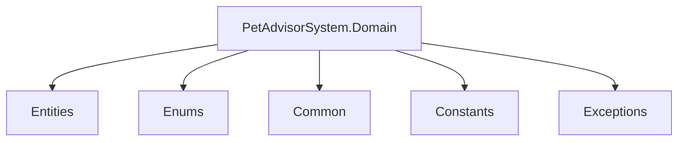

# 📂 Documentation: Domain Layer (PetAdvisorSystem.Domain)

Tài liệu này cung cấp cái nhìn chi tiết (Technical Docs) về cấu trúc, chức năng của từng thư mục và các thư viện (NuGet packages) được sử dụng trong layer **Domain** của dự án **Pet-Advisor-AI**. Thiết kế của chúng ta tuân theo nguyên lý **Data-Driven Architecture** (KISS), tối giản hóa logic để thay vì dùng cấu trúc phức tạp của DDD (Domain-Driven Design).

---

## 📦 1. Tech Stack & NuGet Packages

Layer Domain là lõi thấp nhất của hệ thống, tuyệt đối **không phụ thuộc** vào các Layer khác (Application, Infrastructure, WebAPI).

*   **Target Framework:** `.NET 8.0`
*   **NuGet Packages:**
    *   *Không có thư viện ngoài nào được cài đặt ở Layer này.* Việc giữ nguyên thủy (`Vanilla C#`) giúp Domain nhẹ và độc lập. Các Data Annotations (`[Required]`, `[MaxLength]`) của Entity Framework được áp dụng ở Configuration bên Infrastructure theo chuẩn Clean Architecture, thay vì làm bẩn Entity.

---

## 🏗️ 2. Sơ đồ Cấu trúc Thư mục



---

## 🔍 3. Chức năng từng Thư mục chi tiết

### 📁 3.1. `Common` (Base Components)
**Chức năng:** Chứa các abstract classes, interfaces cơ sở mà mọi đối tượng trong Domain sẽ implement để đảm bảo tính nhất quán của dữ liệu.

*   `BaseEntity.cs`: Class trừu tượng chứa các thuộc tính cốt lõi của bảng Database.
    *   `Id` (`Guid`): Khóa chính UUID chống xung đột Id khi mở rộng hệ thống (Scale).
    *   `CreatedAt` (`DateTime`): Thời điểm Audit.
    *   `UpdatedAt` (`DateTime?`): Thời điểm thay đổi gần nhất.
    *   `IsDeleted` (`bool`): Cờ đánh dấu **Soft Delete** (Không xóa dữ liệu vật lý để đảm bảo dữ liệu quá khứ không bị vỡ).

### 📁 3.2. `Entities` (Thực thể Dữ liệu)
**Chức năng:** Nơi định nghĩa các Cấu trúc Dữ liệu chính (tương ứng với các Tables trong SQL Database).

*   **Nguyên tắc thiết kế (Anemic Domain Model):**
    *   Mọi Property đều khai báo `{ get; set; }` công khai.
    *   **CẤM** viết các hàm xử lý business logic (như tính tiền, tính tuổi) bên trong class này.
    *   Thiết lập Navigation Property: Sử dụng khóa ngoại (Foreign Key) cứng kèm theo từ khóa `virtual` cho Navigation để hỗ trợ **Lazy Loading** của EF Core.

**Ví dụ cấu trúc `Pet.cs`:**
```csharp
namespace PetAdvisorSystem.Domain.Entities;

using PetAdvisorSystem.Domain.Common;
using PetAdvisorSystem.Domain.Enums;

public class Pet : BaseEntity
{
    public string Name { get; set; } = string.Empty;
    public PetType Species { get; set; }

    // Foreign Keys & Navigation
    public Guid OwnerId { get; set; }
    public virtual User Owner { get; set; } = null!;
}
```

### 📁 3.3. `Enums` (Enumerations)
**Chức năng:** Định nghĩa các hằng số liệt kê (Magic Numbers) thành các kiểu dữ liệu có ý nghĩa, dễ đọc hiểu.

*   **Best Practice:** Đặt giá trị Default = 0 cho các trạng thái `Unknown` hoặc `Other`. Luôn gán số minh bạch cho Enum để Database không bị sai lệch nếu sau này thêm/bớt giá trị (Ví dụ: `Cat = 2`).

### 📁 3.4. `Constants` (Hằng số tĩnh)
**Chức năng:** Chứa các `public static class` khai báo hằng số dùng chung trên toàn bộ hệ thống ngay từ cấp độ Domain để tránh Hard-code string/number.

*   `AppConstants.cs`: Lưu trữ độ dài tối đa (Max Length) cho string, Regex patterns, hoặc Message lỗi mặc định.
*   **Ví dụ:** `public const int MaxNameLength = 100;`

### 📁 3.5. `Exceptions` (Lỗi Nghiệp Vụ Riêng Tập)
**Chức năng:** Định nghĩa các Custom Exceptions kế thừa trực tiếp từ `Exception` cục bộ cho dự án.

*   Kĩ thuật này giúp Layer bao bọc bên ngoài (Application) có thể dùng Khối `try-catch(DomainException)` để bắt, phân loại và trả về HTTP Status code tương ứng.

---

## ⚠️ 4. Quy ước Đóng góp (Contribution Rules)

Khi bất cứ lập trình viên nào thao tác trên Layer này, bắt buộc tuân thủ:

1.  **Dependency Rule:** Không cấu hình tham chiếu (`Add Project Reference`) đến bất cứ dự án nào khác (Application, UI, Infrastructure) trong file `PetAdvisorSystem.Domain.csproj`.
2.  **Logic Separation:** Entity tuyệt đối vô hồn. Nếu bạn thấy mình chuẩn bị viết lệnh `if/else` trong một Entity, hãy dừng lại và chuyển logic đó sang `Handler` bên Application Layer.
3.  **No ORM References:** KHÔNG `using Microsoft.EntityFrameworkCore` tại đây. Domain không cần biết Database là SQL Server hay MongoDB.