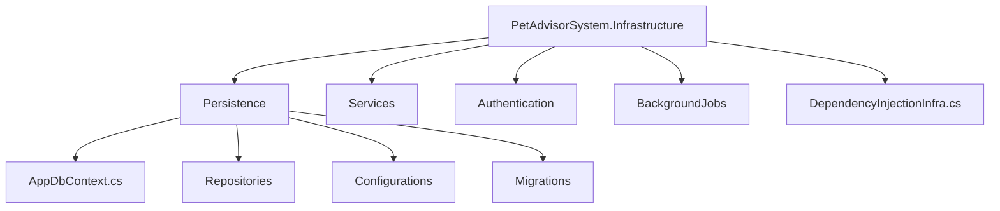

# 📂 Documentation: Infrastructure Layer (PetAdvisorSystem.Infrastructure)

Tài liệu kỹ thuật (Technical Documentation) mô tả chi tiết chức năng, cấu trúc thư mục và hệ sinh thái thư viện (NuGet packages) được sử dụng trong tầng **Infrastructure** của dự án **Pet-Advisor-AI**. Tầng này đóng vai trò là "công nhân" trực tiếp tương tác với các hệ thống bên ngoài, Database, và API của bên thứ 3.

---

## 📦 1. Tech Stack & NuGet Packages

Layer Infrastructure là nơi duy nhất bạn được phép thao tác với Công nghệ thực sự (Database, Cloud Storage, Email Provider,...).

*   **Target Framework:** `.NET 8.0`
*   **Các NuGet Packages tham khảo (.csproj):**
    *   `Microsoft.EntityFrameworkCore.SqlServer`: Provider kết nối SQL Server thông qua EF Core.
    *   `Microsoft.EntityFrameworkCore.Design`: Hỗ trợ gõ lệnh Migration (Add-Migration, Update-Database).
    *   `BCrypt.Net-Next`: Tiện ích băm và kiểm tra mật khẩu User.
    *   `System.IdentityModel.Tokens.Jwt`: Cung cấp thư viện khởi tạo và xác thực Token đăng nhập JWT.
    *   `(Các package ngoài khác như RabbitMQ, AWS S3 SDK nạp vào đây nếu cần thiết).`

---

## 🏗️ 2. Sơ đồ Cấu trúc Thư mục



---

## 🔍 3. Chức năng chi tiết từng Thư mục

### 📁 3.1. `Persistence` (Truy xuất Dữ Liệu)
**Chức năng:** Toàn quyền xử lý, truy vấn Database bằng Entity Framework Core (OR Dapper). Lớp Application sử dụng Interface (`IPetRepository`), thì ở đây sẽ phải viết code Implement thật sự (`PetRepository`).

*   **`AppDbContext.cs`:** Trái tim của quá trình lưu trữ, nó kế thừa `DbContext`. Lưu ý, KHÔNG mapping thẳng các `DbSet<...>` lằng nhằng vào đây, mà dùng `builder.ApplyConfigurationsFromAssembly` để code gọn đẹp.
*   **`Configurations/` (Fluent API Constraints):** Nơi ràng buộc cấu trúc cột trên Database. Thay vì quăng `[Required]`, `[MaxLength]` vào `Pet.cs` của tầng Domain, ở đây chúng ta tách nó ra qua class `PetConfiguration : IEntityTypeConfiguration<Pet>`. Hệ quản trị DB sẽ tự sinh Script SQL chặt chẽ nhất.
*   **`Repositories/`:** Chứa Implementation của các `IRepository`. 
    *   Ví dụ: Class `PetRepository : IPetRepository`. Các thao tác thực tế như `_context.Set<Pet>().Add(pet);` sẽ gọi trực tiếp ở đây. Bọc tất cả Unit of Work thông qua `UnitOfWork : IUnitOfWork`.
*   **`Migrations/`:** Thư mục EF sinh ra tự động khi bạn gõ câu lệnh `dotnet ef migrations add ...`. Không can thiệp code thủ công vào đây nếu không có yêu cầu đặc biệt.

### 📁 3.2. `Services` (Dịch Vụ Ngoại Vi)
**Chức năng:** Thực thi tất cả Interface về dịch vụ bên ngoài mà Application yêu cầu.

*   `EmailService : IEmailService`: Cấu hình SMTP (Gmail, SendGrid) để gửi thư xác thực/reset pass cho chủ Pet.
*   `DateTimeProvider : IDateTimeProvider`: Trả về chuẩn bộ đếm thời gian UTC `DateTime.UtcNow`. (Tách cái này khỏi App để Unit Test Application có thể dễ dàng chèn giờ giả (mock time)).
*   `StorageService : IStorageService`: Các Logic đẩy hình ảnh Thú Cưng lưu lên AWS S3 bucket hoặc Folder local.

### 📁 3.3. `Authentication` (Xác Thực & Phân Quyền)
**Chức năng:** Định nghĩa phương thức đăng nhập và bảo mật quyền truy cập.

*   `JwtTokenProvider : IJwtTokenProvider`: Xây dựng thuật toán tạo chuỗi JWT (Mã hóa Claims, Expiration Time, Secret Key).
*   `PasswordHasher : IPasswordHasher`: Class Wrapper sử dụng thư viện `BCrypt` để `Hash()` / `Verify()` mật khẩu an toàn. Băm password 1 chiều trước khi đưa vào Database.

### 📁 3.4. `DependencyInjectionInfra.cs` (Tiêm Dependencies)
**Chức năng:** Cực kỳ quan trọng, là file chứa `.AddInfrastructure()` dùng để tiêm tất cả "hàng hiệu" của Infrastructure vào bộ chứa `Program.cs`. Application chỉ biết giao diện (Interface), còn file này phụ trách "khâu" giao diện (Interface) lại với code thực thi (Implementation).

**Cấu hình mẫu:**
```csharp
namespace PetAdvisorSystem.Infrastructure;

using Microsoft.Extensions.DependencyInjection;
// ... usings ...

public static class DependencyInjectionInfra 
{
    public static IServiceCollection AddInfrastructure(this IServiceCollection services, IConfiguration configuration)
    {
        // 1. Kết nối Database
        services.AddDbContext<AppDbContext>(options =>
            options.UseSqlServer(configuration.GetConnectionString("DefaultConnection")));

        // 2. Tiêm (Inject) các Repositories
        services.AddScoped<IPetRepository, PetRepository>();
        services.AddScoped<IUnitOfWork, UnitOfWork>();

        // 3. Tiêm các Service mở rộng
        services.AddTransient<IEmailService, EmailService>();
        services.AddSingleton<IDateTimeProvider, DateTimeProvider>();

        return services;
    }
}
```

---

## ⚠️ 4. Quy ước Đóng góp (Contribution Rules)

Khi bất cứ lập trình viên nào code vào phần Infrastructure, cần thuộc lòng 3 điều cấm kỵ sau:

1.  **KHÔNG nhúng Logic Nghiệp vụ vào đây:** Infrastructure là lũ "tay sai" mù mờ đi hỏi ngoại giới, hãy để não bộ Application suy nghĩ. Ví dụ, `EmailService` chỉ làm duy nhất một việc: gửi thông điệp nhận được đi, không viết `if/else` kiểu "nếu user này VIP thì gửi template A, không thì template B" vào đây.
2.  **Che Giấu Công Nghệ Cụ Thể (Hide implementation details):** Không bao giờ làm `Leaks` exception của SQL, AWS S3 vào Application. Tầng này phải luôn bọc Exception lại và quăng ra `DomainException` thân thiện trước khi trả về cho Application.
3.  **Học cách Cấu Hình Fluent API:** Khuyến khích giới hạn EF Core Config nằm trong class `IEntityTypeConfiguration<T>`. Tránh nhồi Constraints (`[MaxLength]`) vào file DbContext.
