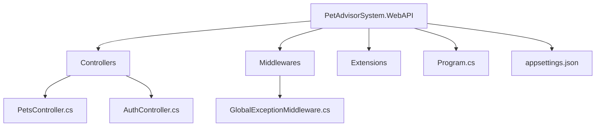

# 📂 Documentation: WebAPI Layer (PetAdvisorSystem.WebAPI)

Tài liệu kỹ thuật (Technical Documentation) này mô tả tầng ngoài cùng của dự án **Pet-Advisor-AI**: tầng **WebAPI** (hay còn gọi là Presentation Layer). Đây là "bộ mặt" của hệ thống, nơi cung cấp các điểm kết nối (Endpoints) để Client (Web, Mobile App) có thể giao tiếp với bộ não Application thông qua các HTTP Requests.

---

## 📦 1. Tech Stack & NuGet Packages

Layer WebAPI rất "mỏng" và tuyệt đối không ôm đồm xử lý tính toán. Công việc chính của nó là nhận Request, đẩy vào cho Application xử lý, và trả kết quả về cho Client.

*   **Target Framework:** `.NET 8.0` (ASP.NET Core Web API)
*   **Các NuGet Packages tham khảo (.csproj):**
    *   `Swashbuckle.AspNetCore`: Cung cấp giao diện Swagger UI để test API và xem Document.
    *   `Microsoft.AspNetCore.Authentication.JwtBearer`: Middleware để xác thực Token (JWT) từ Header của Client gửi lên.
    *   `Serilog.AspNetCore` (Tùy chọn): Thư viện ghi log chuyên nghiệp ra Console, File, hoặc Elasticsearch.

---

## 🏗️ 2. Sơ đồ Cấu trúc Thư mục



---

## 🔍 3. Chức năng chi tiết từng Thư mục

### 📁 3.1. `Controllers` (Trạm Kiểm Soát Không Lưu)
**Chức năng:** Hứng các HTTP Request (GET, POST, PUT, DELETE), xác định ai đang gọi (Authentication), và chuyển hướng (Route) dữ liệu vào trong lõi Application thông qua `MediatR`.

*   **Nguyên tắc "Mỏng như lá lúa" (Thin Controllers):** Controller của dự án này phải cực kỳ mỏng. Mỗi hàm API (Endpoint) chỉ nên dài khoảng 3-5 dòng code. Nó đóng vai trò "người giao liên" mang `Command`/`Query` vào cho Handlers xử lý.

**Ví dụ một Controller chuẩn mực:**
```csharp
namespace PetAdvisorSystem.WebAPI.Controllers;

using MediatR;
using Microsoft.AspNetCore.Mvc;
using Microsoft.AspNetCore.Authorization;
using PetAdvisorSystem.Application.Features.Pets.Commands.CreatePet;

[ApiController]
[Route("api/[controller]")]
public class PetsController : ControllerBase
{
    private readonly IMediator _mediator;

    public PetsController(IMediator mediator)
    {
        _mediator = mediator;
    }

    [HttpPost]
    [Authorize] // Bắt buộc phải đăng nhập mới tạo được Thú cưng
    public async Task<IActionResult> CreatePet([FromBody] CreatePetCommand command)
    {
        // Nhận JSON từ Client, nhét vào Command và ném cho MediatR
        var petId = await _mediator.Send(command);
        
        // Trả về HTTP 200 OK kẹp theo ID của Thú cưng mới
        return Ok(new { Success = true, Data = petId, Message = "Tạo thú cưng thành công!" });
    }
}
```

### 📁 3.2. `Middlewares` (Bộ Lọc Đường Ống)
**Chức năng:** Các "Chốt kiểm tra" đứng chặn giữa Client và Controller. Mọi Request ném vào và Response trả ra đều phải đi qua đây.

*   **`GlobalExceptionMiddleware.cs` (Bắt lỗi toàn cục):** Điểm tụ lỗi duy nhất của toàn hệ thống. Thay vì viết `try-catch` lắt nhắt ở hàng trăm hàm, chúng ta bắt lỗi ở đây.
    *   Nếu Application ném ra `ValidationException` -> Trả về HTTP 400 (Bad Request).
    *   Nếu Application ném ra `NotFoundException` -> Trả về HTTP 404 (Not Found).
    *   Mọi Exception lạ khác (như đứt mạng, sập DB) -> Log lại và trả về HTTP 500 kèm câu xin lỗi "Hệ thống đang bảo trì", để ẩn đi lỗi tiếng Anh thô kệch nhạy cảm (Hide StackTrace).

### 📁 3.3. `Extensions` (Mở Rộng Cấu Hình)
**Chức năng:** Chứa các class `static` giúp tách các đoạn code đăng ký (Register) dài dòng ra khỏi file `Program.cs`.

*   Ví dụ: `services.AddSwaggerGen(...)`, cấu hình nút điền JWT Token trên Swagger sẽ được gom vào class dạng `SwaggerExtension.cs`.

### 📄 3.4. `Program.cs` & `appsettings.json` (Trái Tim Hệ Thống)
**Chức năng:** Điểm chạy đầu tiên (Entry Point) của cả Backend.

*   **`Program.cs` (Kẻ Lắp Ráp):** Triệu hồi và lắp ráp cả 3 tầng hệ thống lại làm một.
    ```csharp
    // ...
    // Hợp thể 3 viên ngọc vô cực!
    builder.Services.AddApplication(); 
    builder.Services.AddInfrastructure(builder.Configuration);
    builder.Services.AddWebAPI(); // (Đăng ký Controller, Swagger...)
    // ...
    ```
*   **`appsettings.json`:** Kho chứa Configuration (Database Connection, JWT Secret Key, Email SMTP configs). **Lưu ý:** Tuyệt đối KHÔNG push file có chứa Password thật lên GitHub (sử dụng .env hoặc Secret Manager thay thế).

---

## ⚠️ 4. Quy ước Đóng góp (Contribution Rules)

Bất kỳ Commit nào vào tầng WebAPI bắt buộc phải tuân theo tiêu chuẩn:

1.  **CẤM Viết Xử Lý Nghiệp Vụ:** Cấm ngặt các thể loại logic `if(user == null)` kiểm tra database hay đổi chuỗi string tại Controller. Hãy ném thẳng Object Command/Query cho `MediatR`. Logic là việc của Application Layer!
2.  **Sử Dụng HTTP Status Code Chuẩn Xác:**  
    *   GET thành công -> `200 OK`
    *   POST (Tạo mới) thành công -> `201 Created`  
    *   Cấm người dùng -> `403 Forbidden`
    *   Không tìm thấy -> `404 Not Found`
3.  **Route Đẹp (RESTful API Design):**
    *   Chuẩn: `GET /api/pets/123` thay vì `GET /api/pets/GetPetById?id=123`.
    *   Danh từ số nhiều (Pets, Users), không dùng Động từ trong Route.
4.  **Luôn Đeo Cục `[Authorize]`:** Bảo vệ API. Mặc định nên chặn toàn bộ API, trừ API Login/Register thì gắn thẻ ngoại lệ `[AllowAnonymous]`.
